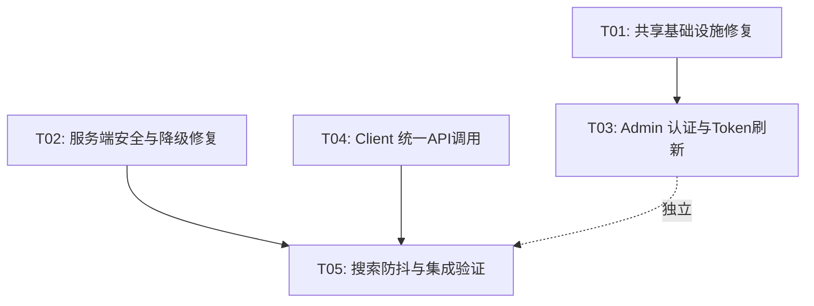

# 知讯平台 — 系统架构设计与任务分解

> **作者**: Bob (架构师)  
> **日期**: 2025-07-07  
> **版本**: 2.0  

---

## 第一部分：实现方案概要

### P0（严重）修复汇总

| 编号 | 问题 | 涉及文件 | 根因 | 修复要点 |
|------|------|----------|------|----------|
| P0-1 | CSRF UA绕过 | `CsrfFilter.java` | 旧版 `isSsrRequest()` 通过 User-Agent 含 `nuxt`/`axios` 即放行，任何浏览器可伪造 | 删除 UA 检测分支与 SSR 密钥通道，仅保留内网 IP 白名单 |
| P0-2 | Admin无Token刷新 | `stores/user.ts`, `api/request.ts`, `utils/storage.ts` | 登录仅存 `accessToken`，无 `refreshToken` 持久化，无401自动刷新逻辑 | 补全 refreshToken 存储、响应拦截器 401→refresh→retry 流程 |
| P0-3 | Client绕过统一API | `pages/index.vue:119-122` | 直接调用 `$fetch`，绕过 `useApi` 的 Token刷新/CSRF注入/统一错误处理 | 全部 `$fetch` 替换为 `useApi().get/post` |
| P0-4 | SQL注入 | `FallbackService.java:130` | `wrapper.last("LIMIT " + page...)` 字符串拼接 | 改用 MyBatis-Plus `Page` + `IPage` 分页或参数化 `wrapper.last("LIMIT {0},{1}")` |
| P0-5 | SearchController 无认证 | `SearchController.java:69-74` | `clearHistory()` 无 `@PreAuthorize` 注解，匿名可调用 | 添加 `@PreAuthorize` 或显式调用 `securityUtil.getCurrentUserId()` 抛异常保护 |

### P1（重要）修复汇总

| 编号 | 问题 | 涉及文件 | 根因 | 修复要点 |
|------|------|----------|------|----------|
| P1-1 | Tailwind断点缺 `xs` | `client/tailwind.config.ts:19-25` | 仅5档断点（sm/md/lg/xl/2xl），缺 `xs: 375px` | 新增 `xs: '375px'` 断点 |
| P1-2 | 数据版本号仅客户端 | `client/composables/useApi.ts:181-190` | 客户端解析 `x-data-version` 但服务端从未下发此响应头 | 服务端添加拦截器下发 `X-Data-Version` 响应头 |
| P1-3 | Redis无保护调用 | `FeedServiceImpl`, `AuthServiceImpl` | `stringRedisTemplate` 直接调 `opsForValue().get()`，Redis宕机即抛异常 | 关键路径包裹 `try-catch`，降级到DB |
| P1-4 | OpenSearch降级返回错误 | `SearchController.java:90-94` | `searchFallback` 仅返回503错误，不调用 `FallbackService.getSearchFallback` | 注入 `FallbackService`，降级时调用DB LIKE搜索 |
| P1-5 | WebSocket SSR崩溃 | `useWebSocket.ts:67` | `window.location.origin` 在 SSR 时 `window` 未定义 | 添加 `import.meta.server` 守卫，服务端跳过连接 |
| P1-6 | Admin refreshToken不持久化 | `stores/user.ts:29-58`, `storage.ts:176-189` | `login()` 未存储 `refreshToken`/`expiresIn`，`STORAGE_KEYS` 缺少对应键 | 添加 `REFRESH_TOKEN`/`TOKEN_EXPIRES_AT` 存储键与存取逻辑 |
| P1-7 | 搜索防抖手工实现 | `client/components/SearchBar.vue:81-95` | 手动 `setTimeout` 防抖，无取消重入保护 | 改用 `@vueuse/core` 的 `useDebounceFn` |
| P1-8 | isTablet 恒为 false | `client/composables/useBreakpoints.ts:41-46` | `breakpoints.current()` 返回 `ComputedRef`，未取 `.value` | 改为 `breakpoints.current().value` 或使用对应的布尔值组合判断 |

---

## 第二部分：任务列表

### T01 — 共享基础设施修复 [P1]

**涉及文件**（5个）：

| 文件路径 | 修改内容 |
|----------|----------|
| `client/tailwind.config.ts` | 新增 `xs: '375px'` 断点，注释更新为"7档断点" |
| `client/composables/useBreakpoints.ts` | `isTablet`：`breakpoints.current()` → `breakpoints.current().value`，修复恒为false |
| `client/composables/useWebSocket.ts` | `getWebSocketUrl()`：包裹 `if (import.meta.server) return ''`，防止 SSR 引用 `window` |
| `admin/src/utils/storage.ts` | `STORAGE_KEYS` 新增 `REFRESH_TOKEN: 'refresh_token'`、`TOKEN_EXPIRES_AT: 'token_expires_at'` |
| `admin/src/types/index.ts` | `LoginResult` 确认已有 `refreshToken`/`expiresIn` 字段（无需改） |

**依赖**: 无  
**实现要点**: 
- Tailwind 断点补全一行配置，同步 `useBreakpoints.ts` 中的断点映射表
- `isTablet` 修复关键：`breakpoints.current()` 在 @vueuse/core 10.x 中返回 `ComputedRef<string|undefined>`，需 `.value`
- WebSocket SSR 死代码路径，`connect()` 本身已有 SSR 守卫但 `getWebSocketUrl` 中 `window` 在模块顶层初始化即执行

---

### T02 — 服务端安全与降级修复 [P0]

**涉及文件**（6个）：

| 文件路径 | 修改内容 |
|----------|----------|
| `server/src/.../security/CsrfFilter.java` | 删除 `isSsrRequest()` 与 `X-SSR-Secret` 相关代码，仅保留内网 IP 白名单 |
| `server/src/.../service/impl/FallbackService.java` | L130 `wrapper.last("LIMIT...")` → 使用 MyBatis-Plus `Page<Article>` 分页，消除 SQL 拼接 |
| `server/src/.../controller/SearchController.java` | `clearHistory()` 添加 `@PreAuthorize("isAuthenticated()")`；`searchFallback()` 注入 `FallbackService` 调用 `getSearchFallback()` |
| `server/src/.../service/impl/SearchServiceImpl.java` | `search()` 方法包裹 try-catch，OpenSearch 异常时调用 `FallbackService.getSearchFallback()` |
| `server/src/.../service/impl/FeedServiceImpl.java` | 所有 `stringRedisTemplate.opsFor*()` 调用包裹 try-catch，异常时走DB降级（已有部分，补全缺失路径） |
| `server/src/.../service/impl/AuthServiceImpl.java` | `login()`/`refresh()`/`logout()` 中 Redis 操作包裹 try-catch，Redis 不可用时跳过黑名单/轮转校验（降级为纯JWT模式） |

**依赖**: 无  
**实现要点**:
- CSRF 修复：删除 UA 绕过是唯一关键改动，内网IP 绕过 + SSR Secret 通道足够覆盖合法 SSR 场景
- SQL 注入用 MyBatis-Plus `Page<Article>(page, pageSize)` + `articleMapper.selectPage(page, wrapper)` 替代字符串拼接
- SearchController `searchFallback` 需注入 `FallbackService` 并在 catch 块中调用

---

### T03 — Admin 端认证与 Token 刷新 [P0/P1]

**涉及文件**（4个）：

| 文件路径 | 修改内容 |
|----------|----------|
| `admin/src/stores/user.ts` | `login()` 中持久化 `refreshToken`、`expiresIn`；新增 `refreshToken()` action 与 `setToken()`；新增 `tokenExpiresAt` 状态 |
| `admin/src/api/request.ts` | 响应拦截器 401 分支：先尝试 `refreshToken()` 再重试原请求（参考 client `useApi.ts` 的队列模式） |
| `admin/src/api/auth.ts` | 新增 `refreshTokenApi(refreshToken: string)` 调用 `/auth/refresh` 接口 |
| `admin/src/router/index.ts` | 路由守卫 `beforeEach`：token 即将过期（5分钟阈值）先刷新再放行 |

**依赖**: T01（STORAGE_KEYS 新增的 `REFRESH_TOKEN`/`TOKEN_EXPIRES_AT`）  
**实现要点**:
- 参考 client `useApi.ts` 的刷新模式：全局锁 + 挂起请求队列，防止并发刷新
- `tokenExpiresAt = Date.now() + expiresIn * 1000`，在拦截器中判断 `Date.now() >= tokenExpiresAt - 5*60*1000`

---

### T04 — Client 端统一 API 调用 [P0]

**涉及文件**（4个）：

| 文件路径 | 修改内容 |
|----------|----------|
| `client/pages/index.vue` | 所有 `$fetch(...)` → `const { get } = useApi(); get(...)`（useApi 已内置 CSRF 注入与统一错误处理） |
| `client/composables/useApi.ts` | （可选）修正数据版本号逻辑：版本号比较后存储为字符串 |
| `client/components/SearchBar.vue` | `handleInput()` 改用 `useDebounceFn(() => fetchSuggestions(), 300)` 替代手动 setTimeout |
| `client/composables/useRequestCache.ts` | 确认版本号失效逻辑与 `useApi.ts` 中的 `x-data-version` 处理一致 |

**依赖**: 无（useApi 已就绪）  
**实现要点**:
- `pages/index.vue` 中约8处 `$fetch` 调用需替换，含 `fetchPage`、`handleRefresh`、`useAsyncData` 中的 banner/announcement 请求
- 替换后自动获得：Token自动携带、Token过期刷新、CSRF Token注入、统一错误处理、403弹框

---

### T05 — 搜索防抖标准化与集成验证 [P1]

**涉及文件**（3个）：

| 文件路径 | 修改内容 |
|----------|----------|
| `client/components/SearchBar.vue` | 完全改为 `useDebounceFn` + `watch(keyword)` 模式，取消手动 `debounceTimer` |
| `admin/src/components/SearchBar.vue` | 输入型字段（`type === 'input'`）添加 `@input` 事件绑定 + 300ms 防抖 emit |
| `server/src/.../controller/SearchController.java` | 确认 `searchFallback` 降级路径在集成后可用（如有遗漏补充） |

**依赖**: T02（SearchController 认证修复）、T04（SearchBar 已改用 useApi）  
**实现要点**:
- client SearchBar：`import { useDebounceFn } from '@vueuse/core'`，`const debouncedFetch = useDebounceFn(fetchSuggestions, 300)`
- admin SearchBar：`@input` 延迟 emit `search` 事件，避免每次按键触发后端请求
- 验证清单：所有搜索路径（客户端搜索栏、搜索建议、热门搜索、管理端搜索）均正常

---

### 任务依赖图



---

## 第三部分：共享知识

### 1. API 响应约定

```typescript
// 所有接口统一响应结构
interface ApiResponse<T> {
  code: number     // 0/200=成功, 401=未认证, 403=无权限, 429=限流, 503=服务不可用
  message: string
  data: T
}
```

### 2. 认证体系

- **Token 类型**: JWT（AccessToken）+ Opaque Token（RefreshToken）
- **AccessToken 有效期**: 由服务端 `expiresIn`（秒）控制，客户端据此计算 `tokenExpiresAt = Date.now() + expiresIn * 1000`
- **Token 刷新阈值**: 过期前 5 分钟（`TOKEN_REFRESH_THRESHOLD = 5 * 60 * 1000`）
- **刷新模式**: 全局锁 + 挂起请求队列（防止并发刷新），参考 `client/composables/useApi.ts` 的 `handleTokenRefresh`

### 3. CSRF 防护约定

- **Cookie**: `XSRF-TOKEN`（HttpOnly=false，前端可读）
- **请求头**: `X-XSRF-TOKEN`（POST/PUT/DELETE/PATCH 时携带）
- **内网白名单**: 同源服务器间调用（127.0.0.1、10.x、172.16-31.x、192.168.x）直接放行
- **排除路径**: `/v1/auth/login`, `/register`, `/refresh`, `/send-code`, `/graph-captcha`, `/forgot-password`

### 4. Redis 降级策略

- **模式**: 所有 Redis 操作必须包裹 try-catch，失败时自动降级到 DB
- **认证降级**: Redis 不可用时跳过 Token 黑名单校验、RefreshToken 轮转校验（降级为纯 JWT 模式，安全性降低但仍可用）
- **Feed 降级**: Redis 缓存未命中/异常时直接查 DB，不缓存降级结果
- **搜索缓存**: Redis 中的 suggest/hot 缓存在异常时返回空数组

### 5. OpenSearch 降级策略

- **自动检测**: `SearchServiceImpl` catch 到 `IOException`/`OpenSearchException` 时自动切换
- **降级实现**: 调用 `FallbackService.getSearchFallback()`，走 DB `LIKE` 查询
- **恢复机制**: 下次请求重新尝试 OpenSearch（不设熔断标记，简单重试）

### 6. 关键常量

```typescript
// Admin 存储键
STORAGE_KEYS = {
  TOKEN: 'token',
  REFRESH_TOKEN: 'refresh_token',
  TOKEN_EXPIRES_AT: 'token_expires_at',
  USER_PERMISSIONS: 'user_permissions',
  // ...
}

// 断点（Tailwind + useBreakpoints 保持一致）
BREAKPOINTS = {
  xs: 375,    // 新增
  sm: 480,
  md: 768,
  lg: 1024,
  xl: 1200,
  '2xl': 1920,
}

// 搜索防抖
SEARCH_DEBOUNCE_MS = 300
```

### 7. 错误码约定

| code | 含义 |
|------|------|
| 0/200 | 成功 |
| 400 | 参数错误 |
| 401 | 未认证/Token过期 |
| 403 | 无权限/CSRF失败 |
| 404 | 资源不存在 |
| 429 | 请求限流 |
| 500 | 服务器内部错误 |
| 503 | 服务降级/不可用 |

---

## 第四部分：未尽事项（UNCLEAR）

1. **数据版本号服务端实现**：P1-2 需要服务端新增响应拦截器下发 `X-Data-Version` 头，版本号生成策略待定（基于构建时间戳 or 手动递增？）
2. **Admin refreshToken API 端点**：需确认 `/v1/auth/refresh` 接口是否已存在且支持 admin 角色调用（client 端已调用此端点，推测通用）
3. **WebSocket 认证方式**：当前通过 URL 参数 `?token=` 传递，建议改为连接后首条消息认证（更安全）
4. **useRequestCache 版本号失效**：T04 中提到的版本号逻辑依赖服务端响应头，如服务端暂不下发则缓存永不过期
